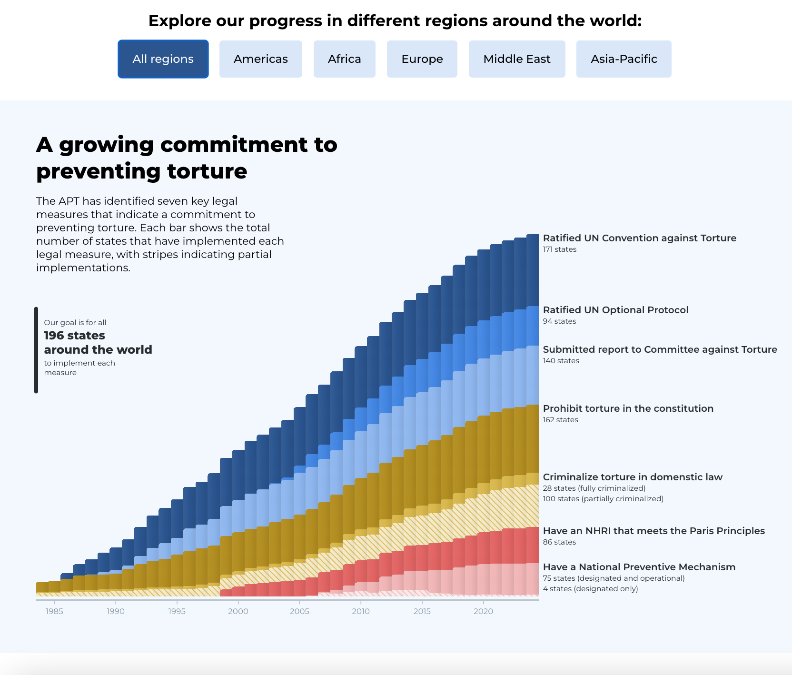
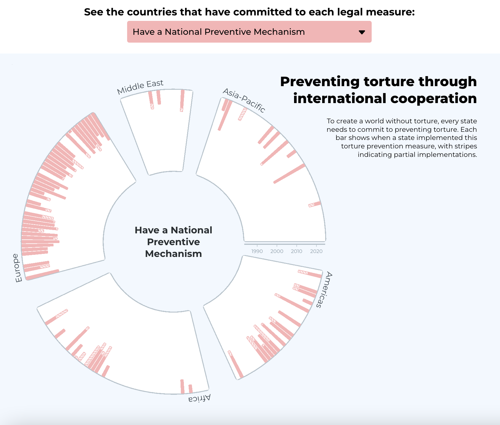

# Viz For Social Good: Association for the Prevention of Torture

Code for my VFSG submission for its [collaboration with the Association for the Prevention of Torture](https://www.vizforsocialgood.com/join-a-project/2024/7/26/apt)

I used R for data exploration and cleaning/transformations, then Javascript and D3.js for the visualisation.

## Screenshots

