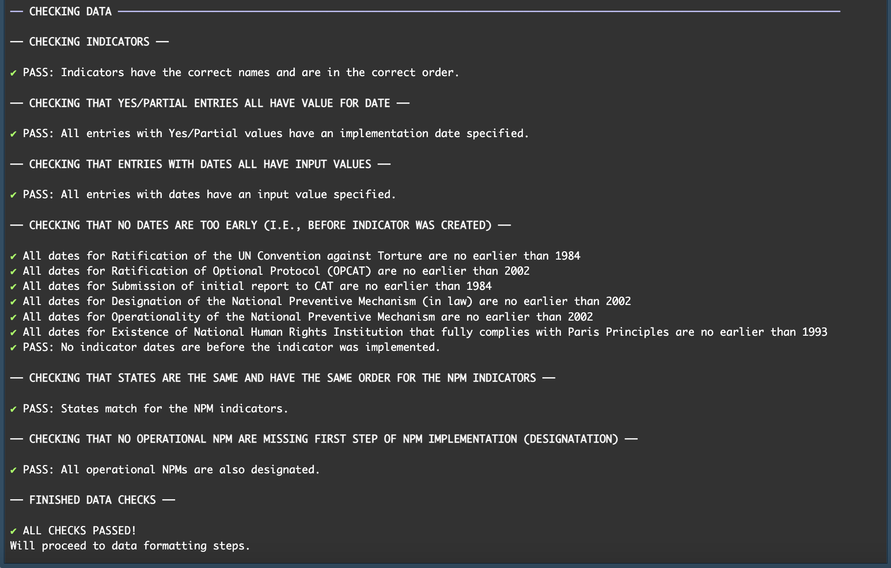
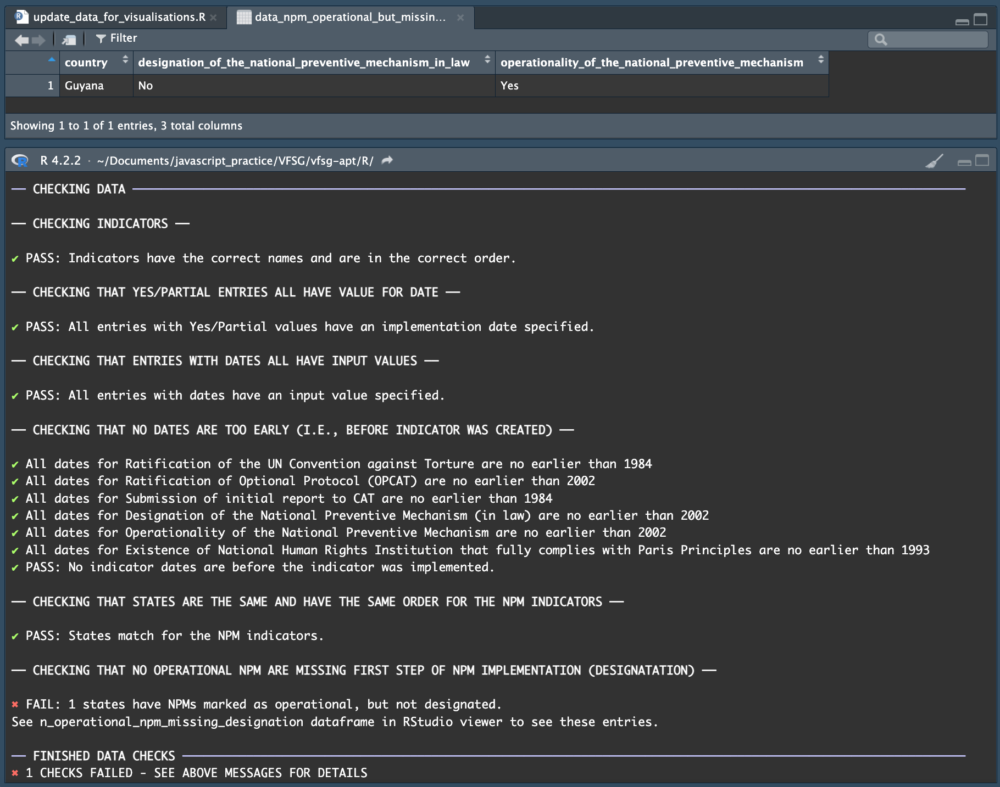

# Visualisations for the Association for the Prevention of Torture

## About 

Updated visualisations for the [Association for the Prevention of Torture (APT)](https://www.apt.ch/), based on my submission for [Viz For Social Good's collaboration with APT](https://www.vizforsocialgood.com/join-a-project/2024/7/26/apt) (see original repo [here](https://github.com/gmschroe/vfsg-apt/)).

See the visualisations at
- [Webpage](https://www.gmschroeder.com/apt-vis-2025/)
- [Blog post](https://www.gmschroeder.com/data_vis/vfsg-apt-blog/) (VFSG submission - older version)

I used R for data exploration and cleaning/transformations, then Javascript/HTML/CSS (including D3.js) for the visualisation. The R code is contained in the [`R`](R/) subfolder, while the visualisation code is in the [`docs`](docs/) subfolder.

## Running locally

### Updating APT data on torture prevention indicators

After downloading or cloning this repository onto your computer:

1) Open RStudio with R version 4.2.2 (I recommend using [`rig`](https://github.com/r-lib/rig) if you need to manage multiple R versions on your computer) and then open the project (File > Open Project..., then navigate to [`apt-vis-2025/R/R.Rproj`](R/R.Rproj) and open it).

Alternatively, you can use `rig` to launch RStudio using the correct R version by first installing R version 4.2.2 using `rig` (if you have not already done so) by running `rig install 4.2.2` in a terminal, navigating to the `apt-vis-2025` directory (using the `cd` command), and then running `rig rstudio R/renv.lock` to open the project.

Your working directory should be `[your local path]/apt-vis-2025/R`. You can check your working directory using `getwd()` in the R console.

2) I use `renv` to manage the package versions used in the project. Restore the project's `renv` environment using `renv::restore()` in the R console. If any packages in the lockfile are not installed, follow the outputted `renv` instructions to install them.

3) Open [`apt-vis-2025/R/update_data_for_visualisations.R`](R/update_data_for_visualisations.R) and follow the instructions in the script ("Steps to update") for providing a new data file, formatting that data, and saving the new data in the required format. This script will also update the data used by the visualisation and open the new version of the visualisation in a web browser. 

> [!CAUTION]
> The formatted data, name of the original data file, and name of the data export folder may be accessible via the webpage - do not include sensitive information in this data! 

The update script runs checks on the new data to help ensure that certain assumptions about the data are satisfied. The results of these checks will be outputted to the R console. 

Example of successful checks:



For each failed check, the output messages will note the failure and also open a dataframe in RStudio containing the entries that caused the check to fail. **If a check fails, the script will stop and the data will not be updated**.

Example of a failed check: 



### Visualising the data

The visualisation code does not require a package manager such as NPM - it uses a `<script>` element to add the D3.js dependency to the project.

To run the visualisation website locally in a web browser, you can 

1) Use R: first follow steps 1-2 in "Updating APT data on torture prevention indicators" to open the R project and install the dependencies, and then run the last section of

[`apt-vis-2025/R/update_data_for_visualisations.R`](R/update_data_for_visualisations.R):

```
# Library for viewing visualisation locally in web browser 
library(servr)

# Launch vis
vis_path <- file.path("..", "docs")
servr::httw(dir = vis_path)
```

which will open the visualisation using the last version of the data that was saved to the visualisation folders.

(Running the entire script should also work, assuming the last specified data file is valid - it will just unnecessarily repeat the validation checks and data formatting.)

2) Use VSCode: Alternatively, you can open the [`apt-vis-2025/docs/`](docs/) folder in [Visual Studio Code](https://code.visualstudio.com/) and use the [Live Server extension](https://marketplace.visualstudio.com/items?itemName=ritwickdey.LiveServer) to launch the visualisation in a web browser.


## Deploying

The website is deployed using [GitHub Pages](https://docs.github.com/en/pages), with the [`apt-vis-2025/docs`](docs/) folder (which contains the visualisation code) configured as the [publishing source](https://docs.github.com/en/pages/getting-started-with-github-pages/configuring-a-publishing-source-for-your-github-pages-site). Any updates to this folder in the main branch of the repo will update this website.


## Running tests

There are unit tests for the data validity checks in [`R/lib/tests`](R/lib/tests). These tests can be run by following the above instructions (steps 1-2 in "Updating APT data on torture prevention indicators") to open the project in R, then running 

```
testthat::test_dir(file.path("lib", "tests"))
```

Note that **these tests are designed to test the code - they do NOT perform any checks on the data**. If you are updating the data, you do not need to interact with this part of the code. The tests are useful if you want to further develop this codebase and verify that your changes have not broken existing functionality.
